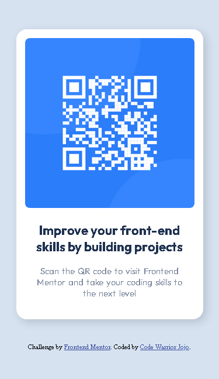
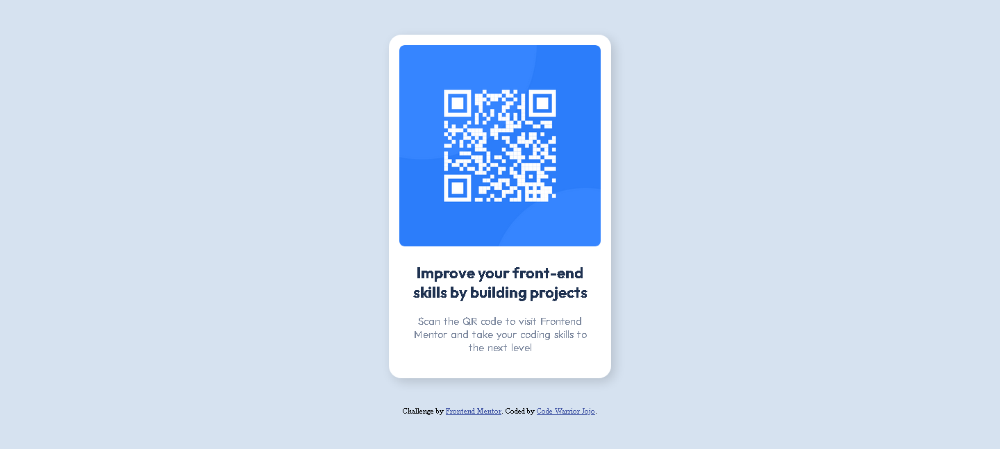

# Frontend Mentor - QR code component solution

This is a solution to the [QR code component challenge on Frontend Mentor](https://www.frontendmentor.io/challenges/qr-code-component-iux_sIO_H). Frontend Mentor challenges help you improve your coding skills by building realistic projects. 

## Table of contents

- [Frontend Mentor - QR code component solution](#frontend-mentor---qr-code-component-solution)
  - [Table of contents](#table-of-contents)
  - [Overview](#overview)
    - [Screenshots](#screenshots)
    - [Links](#links)
  - [My process](#my-process)
    - [Built with](#built-with)
    - [What I learned](#what-i-learned)
    - [Continued development](#continued-development)
    - [Useful resources](#useful-resources)
  - [Author](#author)


## Overview

### Screenshots




### Links

- Live Site URL: [CodeWarriorJojo](https://codewarriorjojo.github.io/)

## My process

  - Started with vertical and horizontal layouts: I began by implementing both vertical and horizontal layout to ensure flexibility and responsiveness all while applying the proper HTML semantics to make it more accessible.
  
  - For the Css, I start by removing the default styling of: margin, padding and box-sizing then add Custom CSS properties to make it easier to adjust styles later on. 
  
  - Default styles such as font-family, color and background color are are added to the css before moving on to the Media Query.

  - For the Media Query, styles such as: margin, paddings and width,  is then added for the mobile.

  
 


### Built with

- Semantic HTML5 markup
- CSS custom properties
- Mobile-first workflow


### What I learned


```css

@media (min-width: 375px) {
  

    .card {
        width: 320px;
        margin: 50px auto 40px;
        border-radius: 18px;
        padding: 15px;
        box-shadow: 5px 5px 15px var(--CardShadow);
    }
    .qr-code-image-container {
        margin: 0 auto;
    }

    .info {
        
        padding: 0 15px;
    }
    .title {
        font-size: 22px;
        margin-block: 20px 18px;
    }
    .info p {
        word-spacing: 2px;
        padding-bottom: 20px;
    }
   
   
       
}


```

### Continued development

In my future projects, I will prioritize the following areas:

 1. CSS Custom Properties
 2. Media Queries
 3. Mobile-first Workflow 

### Useful resources

- [MDN Web Docs](https://developer.mozilla.org/en-US/) - This is great for finding references on HTML and CSS.
- [Master Media Queries And Responsive CSS Web Design Like a Chameleon!](https://youtu.be/K24lUqcT0Ms) - This really helped me to understand Media Queries more clearly.

## Author

- Frontend Mentor - [@codewarriorjojo](https://www.frontendmentor.io/profile/CodeWarriorJoJo)


